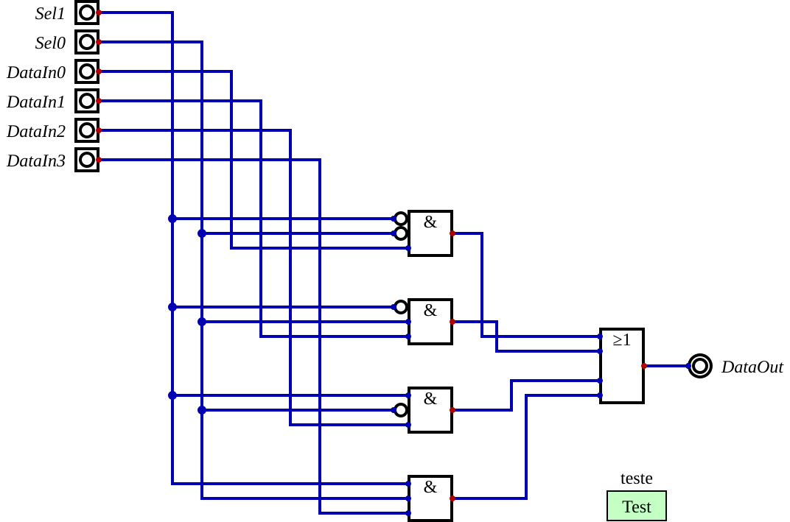
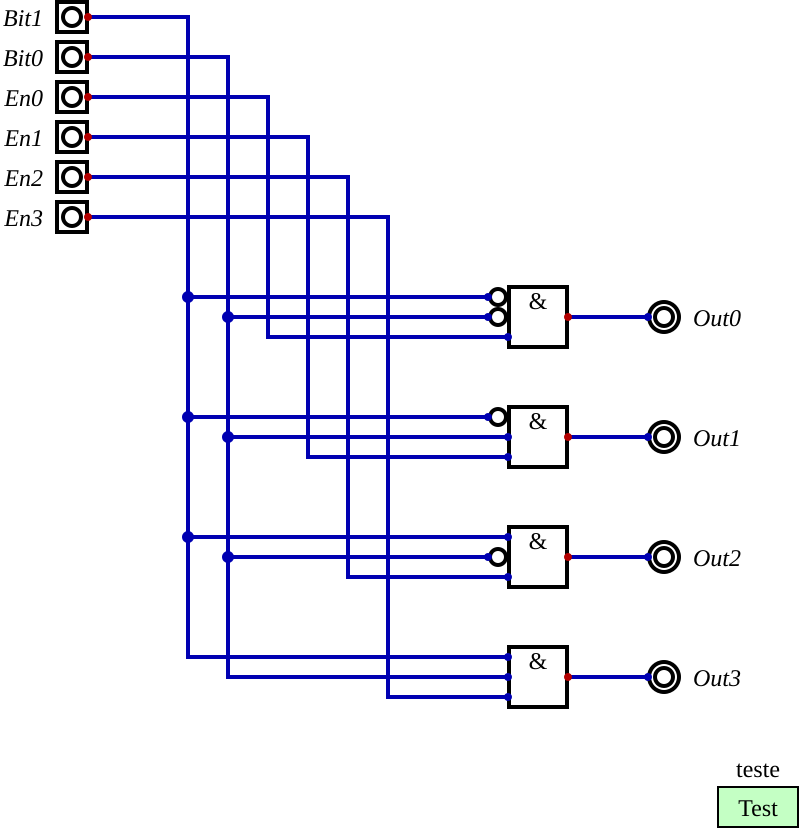

# SD2 — 1º Trabalho de Laboratório · Aula 1

**Sistemas Digitais 2 · LEEC · ESTSetúbal/IPS · 2026/27**
Gestão do display da placa Basys3 (Tutorial Digital e Vivado).

Este repositório contém o trabalho das **Aulas 1 e 2** do enunciado (a Aula 2 está na [secção 5](#5-aula-2--registo-transcodificador-divisor-de-clock-e-contador)). Aula 1:

1. Multiplexer 4x1 — desenho e simulação no Digital, exportação para Verilog, projeto Vivado, testbench, simulação, bitstream (secções 2.1–2.9)
2. Descodificador 2x4 com enables individuais nas saídas, com o mesmo procedimento (secção 2.10)
3. Multiplexer 16x4 feito com hierarquia de módulos, usando 4 multiplexers 4x1 (secção 3)

Ferramentas: Digital (H. Neemann) v0.31, Vivado 2026.1 (WebPack), FPGA `xc7a35ticpg236-1L` (Basys3).

## Estrutura

```
digital/                    Esquemas Digital (.dig), Verilog exportado (.v) e imagem (.svg)
multiplexer4x1/             multiplexer4x1.v, multiplexer4x1.xdc, multiplexer4x1_teste1.v
descodificador2x4/          descodificador2x4.v, descodificador2x4.xdc, descodificador2x4_teste1.v
multiplexer16x4/            multiplexer16x4.v, multiplexer16x4.xdc, multiplexer16x4_teste1.v
simulacao/                  Formas de onda das simulações comportamentais (VCD do xsim)
bitstreams/                 Ficheiros .bit para programar a Basys3 (Adept) + relatórios de utilização
vivado/<nome>/<nome>.xpr    Projetos Vivado (abrir com File – Project – Open)
scripts/build.tcl           Recria os 3 projetos Vivado, simula e gera os bitstreams
scripts/gen_dig.py          Gera os esquemas .dig (com teste da tabela de verdade incluído)
scripts/ExportVerilog.java  File – Export – Export to Verilog do Digital, por linha de comandos
```

Para abrir um projeto no Vivado: **File – Project – Open** e escolher `vivado/<nome>/<nome>.xpr`. Os ficheiros fonte são referidos por caminhos relativos, por isso funcionam em qualquer pasta. Na primeira abertura, a síntese e a implementação aparecem por correr, porque os resultados não estão no repositório.

Para recriar os projetos de raiz, com simulação e bitstreams, de uma só vez:

```bash
vivado -mode batch -source scripts/build.tcl
```

Ou, no Vivado em modo gráfico: criar o projeto com o wizard e adicionar os ficheiros `.v` (Design Sources), o `.xdc` (Constraints) e o `_teste1.v` (Simulation Sources) da pasta respetiva. No multiplexer 16x4 também se adiciona `multiplexer4x1/multiplexer4x1.v`.

---

## 1. Multiplexer 4x1

### 1.1 Esquema no Digital

4 ANDs de 3 entradas (com as entradas de seleção invertidas onde é preciso) e 1 OR de 4 entradas.



### 1.2 Simulação no Digital — tabela de seleção

O esquema inclui um caso de teste com as **64 combinações** das entradas. Passa todas (`java -cp Digital.jar CLI test -circ digital/multiplexer4x1.dig` → `teste: passed`). Resumo:

| Sel1 | Sel0 | Entrada representada na saída (DataOut) |
|:---:|:---:|:---|
| 0 | 0 | DataIn0 |
| 0 | 1 | DataIn1 |
| 1 | 0 | DataIn2 |
| 1 | 1 | DataIn3 |

### 1.3 Verilog exportado do Digital

```verilog
module multiplexer4x1 (
  input Sel1,
  input Sel0,
  input DataIn0,
  input DataIn1,
  input DataIn2,
  input DataIn3,
  output DataOut
);
  assign DataOut = ((~ Sel1 & ~ Sel0 & DataIn0) | (~ Sel1 & Sel0 & DataIn1) | (Sel1 & ~ Sel0 & DataIn2) | (Sel1 & Sel0 & DataIn3));
endmodule
```

É uma descrição **comportamental**: diz a função do circuito sem instanciar componentes.

### 1.4 Restrições (`multiplexer4x1.xdc`)

As mesmas do enunciado:

| Sinal | Pino | Na Basys3 |
|---|---|---|
| Sel1 / Sel0 | R2 / T1 | interruptores SW15 / SW14 |
| DataIn0 / DataIn1 / DataIn2 / DataIn3 | U17 / T17 / U18 / W19 | teclas BTND / BTNR / BTNC / BTNL |
| DataOut | V14 | LED LD7 |

### 1.5 Testbench e simulação comportamental

`multiplexer4x1_teste1.v` segue a estrutura do enunciado (`S`, `D`, `Z`, UUT, ciclo `for` com `case`), mas com uma **sequência personalizada**. Para cada valor de seleção:

- só a entrada selecionada fica a 1 → **Z=1**;
- depois todas as outras ficam a 1, menos a selecionada → **Z=0**.

Isto mostra que só a entrada selecionada chega à saída. No fim, as entradas ficam todas a 1 e a seleção percorre 3→0. O testbench também verifica automaticamente se `Z == D[S]` a cada mudança.

> *Captura de ecrã da simulação do multiplexer 4x1 no Vivado: a acrescentar.*

Resultado do xsim: `Simulacao OK: multiplexer4x1 sem erros`.

---

## 2. Descodificador 2x4 com enables individuais nas saídas

Entradas `Bit1`, `Bit0` e `En0`–`En3`; saídas `Out0`–`Out3` (Fig. 26 do enunciado). A saída `Outi` só fica ativa quando o valor de `Bit1 Bit0` é *i* **e** `Eni = 1`:

`Out0 = ~Bit1·~Bit0·En0`  `Out1 = ~Bit1·Bit0·En1`  `Out2 = Bit1·~Bit0·En2`  `Out3 = Bit1·Bit0·En3`

### 2.1 Esquema no Digital



Este esquema também passa o teste das 64 combinações no Digital. Tabela resumida (X = indiferente):

| Bit1 | Bit0 | En3 En2 En1 En0 | Out3 Out2 Out1 Out0 |
|:---:|:---:|:---:|:---:|
| 0 | 0 | X X X 1 | 0 0 0 1 |
| 0 | 1 | X X 1 X | 0 0 1 0 |
| 1 | 0 | X 1 X X | 0 1 0 0 |
| 1 | 1 | 1 X X X | 1 0 0 0 |
| *i* | | En*i* = 0 | 0 0 0 0 |

### 2.2 Verilog exportado do Digital

```verilog
module descodificador2x4 (
  input Bit1,
  input Bit0,
  input En0,
  input En1,
  input En2,
  input En3,
  output Out0,
  output Out1,
  output Out2,
  output Out3
);
  assign Out0 = (~ Bit1 & ~ Bit0 & En0);
  assign Out1 = (~ Bit1 & Bit0 & En1);
  assign Out2 = (Bit1 & ~ Bit0 & En2);
  assign Out3 = (Bit1 & Bit0 & En3);
endmodule
```

### 2.3 Restrições (`descodificador2x4.xdc`)

| Sinal | Pino | Na Basys3 |
|---|---|---|
| Bit1 / Bit0 | R2 / T1 | interruptores SW15 / SW14 |
| En0 / En1 / En2 / En3 | V17 / V16 / W16 / W17 | interruptores SW0 / SW1 / SW2 / SW3 |
| Out0 / Out1 / Out2 / Out3 | U16 / E19 / U19 / V19 | LEDs LD0 / LD1 / LD2 / LD3 |

### 2.4 Testbench e simulação comportamental

`descodificador2x4_teste1.v` faz o seguinte:

1. Com todos os enables ativos, percorre os 4 códigos de entrada → acende uma saída de cada vez.
2. Desativa os enables um a um e mostra que a saída correspondente deixa de acender.
3. Mostra que um enable ativo numa saída **não selecionada** não acende nada (B=3 com só En2=1, e B=2 com todos menos En2).

A verificação automática compara `O` com `(0001 << B) & E`.

> *Captura de ecrã da simulação do descodificador 2x4 no Vivado: a acrescentar.*

Resultado do xsim: `Simulacao OK: descodificador2x4 sem erros`.

---

## 3. Multiplexer 16x4 (hierarquia de módulos)

Tem 4 entradas de 4 bits (`DataIn0`–`DataIn3`), seleção `Sel[1:0]` e saída `DataOut[3:0]` (Fig. 27).
É uma descrição **estrutural**: instancia 4 multiplexers 4x1 (`mux0`–`mux3`). Cada um trata um bit e todos partilham a seleção.

```verilog
module multiplexer16x4(
    input [3:0] DataIn0,
    input [3:0] DataIn1,
    input [3:0] DataIn2,
    input [3:0] DataIn3,
    output [3:0] DataOut,
    input [1:0] Sel
    );
     multiplexer4x1 mux0 (.Sel1(Sel[1]), .Sel0(Sel[0]),
         .DataIn0(DataIn0[0]), .DataIn1(DataIn1[0]), .DataIn2(DataIn2[0]), .DataIn3(DataIn3[0]),
         .DataOut(DataOut[0]));
     // mux1, mux2 e mux3: iguais, para os bits 1, 2 e 3 (ver multiplexer16x4/multiplexer16x4.v)
endmodule
```

Hierarquia no Vivado (Fig. 29):

```
multiplexer16x4
├── mux0 : multiplexer4x1
├── mux1 : multiplexer4x1
├── mux2 : multiplexer4x1
└── mux3 : multiplexer4x1
```

### 3.1 Restrições (`multiplexer16x4.xdc`)

São precisos 16 bits de dados, por isso são usados os 16 interruptores. A seleção fica nas teclas:

| Sinal | Na Basys3 |
|---|---|
| DataIn0[3:0] | SW3–SW0 |
| DataIn1[3:0] | SW7–SW4 |
| DataIn2[3:0] | SW11–SW8 |
| DataIn3[3:0] | SW15–SW12 |
| Sel[1] / Sel[0] | teclas BTNL / BTNR (premidas = 1) |
| DataOut[3:0] | LEDs LD3–LD0 |

### 3.2 Testbench e simulação comportamental

`multiplexer16x4_teste1.v` faz o seguinte:

1. Coloca valores diferentes nas 4 entradas (A, 5, C, 3) e percorre as 4 seleções.
2. Muda uma entrada não selecionada → a saída não muda.
3. Muda a entrada selecionada → a saída acompanha.
4. Testa cada bit isoladamente (1, 2, 4, 8) para confirmar que cada um dos 4 mux4x1 está bem ligado.

> *Captura de ecrã da simulação do multiplexer 16x4 no Vivado: a acrescentar.*

Resultado do xsim: `Simulacao OK: multiplexer16x4 sem erros`.

---

## 4. Bitstreams e ensaio na Basys3

Os 3 projetos passaram a síntese, a implementação e a geração do bitstream sem erros:

| Projeto | Bitstream |
|---|---|
| multiplexer4x1 | [`bitstreams/multiplexer4x1.bit`](bitstreams/multiplexer4x1.bit) |
| descodificador2x4 | [`bitstreams/descodificador2x4.bit`](bitstreams/descodificador2x4.bit) |
| multiplexer16x4 | [`bitstreams/multiplexer16x4.bit`](bitstreams/multiplexer16x4.bit) |

Para programar a placa (secção 2.9): ligar a Basys3 por USB, abrir o **Adept**, selecionar o `.bit` e carregar em **Program**. Deve aparecer *Programming Successful*.

Ensaio na placa:

- **multiplexer4x1**: usar SW15/SW14 para escolher a tecla (00=BTND, 01=BTNR, 10=BTNC, 11=BTNL). O LED LD7 acende só quando essa tecla está premida.
- **descodificador2x4**: SW15/SW14 escolhem a saída e SW0–SW3 são os enables. Acende no máximo um LED (LD0–LD3), e só se o enable dele estiver ligado.
- **multiplexer16x4**: os LEDs LD3–LD0 mostram SW3–0 (sem teclas), SW7–4 (BTNR), SW11–8 (BTNL) ou SW15–12 (BTNL+BTNR).

> Falta o ensaio físico na placa e a apresentação ao docente. Têm de ser feitos no laboratório.

---

## 5. Aula 2 — registo, transcodificador, divisor de clock e contador

Todos estes módulos estão no projeto Vivado `vivado/displayBCD/displayBCD.xpr`:

| Ficheiro (`displayBCD.srcs/sources_1/new/`) | Módulo | Testbench (`sim_1/new/`) |
|---|---|---|
| `registo4.v` | `Registo4` | `registo4_teste1.v` |
| `transcod7seg.v` | `Transcod7Seg` | `transcod7seg_teste1.v` |
| `divisorCLK.v` | `DivisorClock` | `divisorclk_teste1.v` |
| `contador4.v` | `Contador4` | `contador4_teste1.v` |
| `displayBCD.v` | `displayBCD` (topo do ensaio na placa) | `displaybcd_teste1.v` |

Para correr todas as simulações e gerar o bitstream:

```bash
vivado -mode batch -source scripts/build_aula2.tcl
```

No Vivado em modo gráfico, para simular um módulo: escolher o testbench em *Simulation Sources*, clicar com o botão direito, **Set as Top** e depois **Run Behavioral Simulation**.

### 5.1 Registo de 4 bits com clear e enable (`Registo4`)

Usa 4 primitivas **FDCE**, uma por bit. Cada FDCE é um flip-flop D sensível ao flanco ascendente, com clear assíncrono (`CLR`) e clock enable (`CE`). As portas `Data[3:0]`, `CE`, `Clk`, `CLR` e `DataOut[3:0]` seguem a Fig. 31.

O testbench usa um relógio de 100 MHz e tem duas partes:

1. **Casos dirigidos:**
   - valor inicial 0;
   - com `CE=0` o registo não muda;
   - com `CE=1` carrega `Data` no flanco ascendente;
   - entre flancos a saída mantém-se;
   - o `CLR` limpa logo, sem esperar pelo flanco (assíncrono);
   - o `CLR` tem prioridade sobre o `CE`;
   - depois de libertar o `CLR`, o registo só carrega no flanco seguinte;
   - os 16 valores possíveis;
   - um bit a 1 a andar e um bit a 0 a andar.
2. **2000 ciclos com entradas aleatórias** (`Data`, `CE` e `CLR`, este em instantes que não coincidem com o relógio). A saída é comparada continuamente com um **modelo de referência**. O testbench também verifica que a saída nunca muda fora de um flanco ascendente, a não ser com `CLR` ativo.

### 5.2 Transcodificador para 7 segmentos (`Transcod7Seg`)

Entrada `Numero[3:0]`, saída `Segmentos[6:0]`, com `Segmentos[6]` = a … `Segmentos[0]` = g. As saídas são **ativas a Low**: 0 acende o segmento.

| Numero | 0–9 | 10 | 11 | 12 | 13 | 14 | 15 |
|---|---|---|---|---|---|---|---|
| Símbolo | algarismos da Fig. 30 | d | I (lado esquerdo) | E | G | o | - |

Os símbolos originais de 10 a 15 formam **"dIEGo-"**.

O testbench percorre os 16 valores e compara cada saída com uma tabela escrita em lógica positiva, a partir da Fig. 30. Também verifica que:

- nenhum segmento fica indefinido (X ou Z);
- os **16 símbolos são todos diferentes**, ou seja, nenhum é ambíguo no display;
- a saída só depende do valor atual. Para isso, repete os 16 valores duas vezes por ordem aleatória.

### 5.3 Divisor de clock (`DivisorClock`)

Conta `METADE` ciclos de `ClockIn` e depois inverte `ClockOut`. Assim, f_out = 100 MHz / (2 × METADE). Por omissão `METADE = 25000`, o que dá **2 kHz**, dentro do intervalo pedido (1–10 kHz). Para ver os displays a piscar durante o debug pode usar-se `METADE = 25_000_000`, que dá 2 Hz.

O testbench simula várias instâncias ao mesmo tempo, com `METADE` = 1, 2, 5 e 7 (50 períodos cada). Simula também o **valor usado na placa (25000)** durante 12 períodos, ou seja, 6 ms.

Em todos os períodos verifica que:

- a saída está a 1 durante exatamente `METADE` ciclos e a 0 durante outros tantos (duty cycle de 50%);
- só muda nos flancos ascendentes de `ClockIn`;
- a frequência na placa é 2000 Hz, dentro do intervalo 1–10 kHz.

O VCD só guarda os primeiros 2 µs, para não ficar com dezenas de MB.

### 5.4 Contador de módulo 4 (`Contador4`)

Contador de 2 bits que avança no flanco ascendente de `Clock`: 0, 1, 2, 3, 0, … As saídas são `Q1` e `Q0`.

O testbench verifica:

- o estado inicial 0;
- a sequência durante 100 flancos (25 voltas);
- que o estado não muda no flanco descendente;
- que as saídas mudam exatamente uma vez por ciclo, e só no flanco ascendente.

### 5.5 Ensaio do transcodificador na Basys3 (`displayBCD`)

| Sinal | Na Basys3 |
|---|---|
| `Numero[3:0]` | SW3–SW0 |
| `Liga[3:0]` | SW15–SW12: escolhem quais displays acendem (os ânodos são ativos a Low) |
| `Segmentos[6:0]`, `DotPoint` | segmentos CA–CG e DP (o ponto fica apagado) |
| `Anodos[3:0]` | AN3–AN0 |

O testbench `displaybcd_teste1.v` percorre as **256 combinações** de `Numero` e `Liga`. Verifica os segmentos, os ânodos (a negação de `Liga`) e que o ponto decimal fica apagado.

Bitstream: [`bitstreams/displayBCD.bit`](bitstreams/displayBCD.bit). Ligar, por exemplo, SW12, que acende o display da direita, e percorrer os valores 0–15 em SW3–SW0.

### 5.6 Resultados e validação dos testbenches

Resultados do xsim (Vivado 2026.1, com a primitiva FDCE verdadeira):

```
Simulacao OK: Registo4 sem erros (3056 verificacoes)
Simulacao OK: Transcod7Seg sem erros (48 verificacoes)
Simulacao OK: DivisorClock sem erros
Simulacao OK: Contador4 sem erros (100 ciclos)
Simulacao OK: displayBCD sem erros (256 combinacoes)
```

Um testbench que passa não prova nada se também passar com um módulo errado. Por isso, os testbenches foram validados com um **teste de mutações**: introduziram-se, um de cada vez, 19 erros típicos numa cópia dos módulos e confirmou-se que o testbench respetivo falha em todos. Para repetir: `python3 scripts/teste_mutacoes.py` (precisa do Icarus Verilog).

| Módulo | Erros introduzidos (todos detetados) |
|---|---|
| Registo4 | CE ignorado · clear síncrono · CLR ignorado · flanco descendente · bits 0 e 1 trocados · bit 3 preso a 0 |
| Transcod7Seg | 7 com o segmento f aceso · saídas ativas a High · G igual ao 6 · valor 15 em falta |
| DivisorClock | conta METADE+1 · flanco descendente · METADE por omissão errado (250 → 200 kHz) |
| Contador4 | conta a descer · módulo 3 · flanco descendente · Q1 e Q0 trocados |
| displayBCD | ânodos não negados · ponto decimal aceso |

**19/19 erros detetados.**

> *Capturas de ecrã das simulações no Vivado: a acrescentar.*
